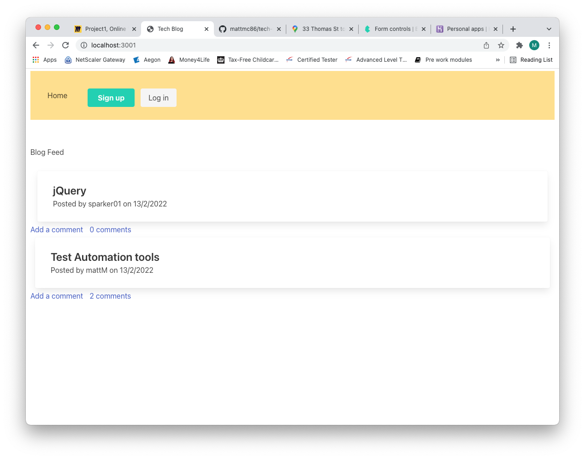

# Tech Blog
  
  
  ## Description
  
   A full stack application to allow users to post blogs and comment on other users blogs. Built with express, handlerbars, mySQL2, sequelize. Styled with Bulma. 
   Deployed application: 

   
   
  ## Table of Contents
  * [Installation](#installation)
  * [Usage](#usage)
  * [License](#license)
  * [Contributing](#contributing)
  * [Tests](#tests)
  * [Questions](#questions)
  
  ## Installation
  npm i
  ## Usage
  View tech blogs and create an account to able to add comments to existing blogs or post your own.
  ## License
  https://opensource.org/licenses/MIT
  This project is under the license of MIT
  ## Contributing 
  Feel free to get in touch
  ## Tests
  no tests
  ## Questions
  If you have any questions about this project, you can contact me at matthewmckenna1986@hotmail.com. More projects available here https://github.com/mattmc86.

